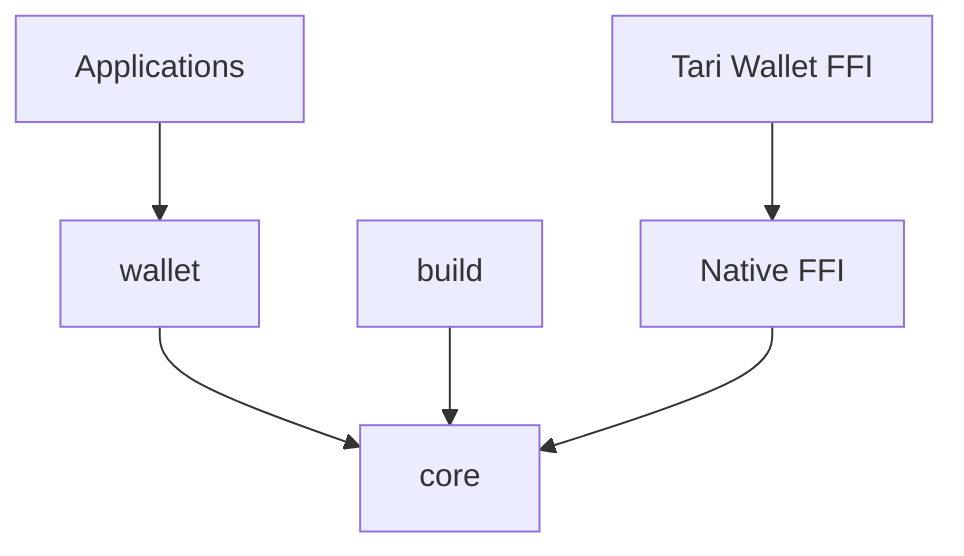

# Development Guide

This guide covers the development workflow for contributing to the Tari JavaScript SDK.

## Development Environment

### Prerequisites

- **Node.js**: 18.0.0 or higher (use the version specified in `.nvmrc`)
- **npm**: 8.0.0 or higher
- **Git**: Latest version with commit signing configured
- **Rust**: 1.70.0 or higher (for FFI development in later phases)

### Initial Setup

1. **Clone the Repository**
   ```bash
   git clone https://github.com/tari-project/tari-javascript-sdk.git
   cd tari-javascript-sdk
   ```

2. **Use Correct Node Version**
   ```bash
   # If using nvm
   nvm use
   
   # Or install the specified version
   nvm install $(cat .nvmrc)
   ```

3. **Install Dependencies**
   ```bash
   npm install
   ```

4. **Verify Setup**
   ```bash
   npm run build
   npm test
   npm run lint
   ```

## Project Structure

### Monorepo Layout

```
tari-javascript-sdk/
├── packages/
│   ├── core/              # Core FFI bindings and utilities
│   │   ├── src/
│   │   │   ├── types/        # Type definitions
│   │   │   ├── errors/       # Error handling
│   │   │   ├── utils/        # Utility functions
│   │   │   └── index.ts      # Main entry point
│   │   ├── tests/            # Test files
│   │   ├── package.json      # Package configuration
│   │   └── README.md         # Package documentation
│   │
│   ├── wallet/            # High-level wallet API
│   │   ├── src/
│   │   │   ├── types/        # Wallet-specific types
│   │   │   ├── models/       # Domain models
│   │   │   ├── wallet/       # Main wallet class
│   │   │   └── index.ts      # Main entry point
│   │   └── ...
│   │
│   └── build/             # Build utilities (private)
│       ├── src/
│       │   ├── fetch/        # Source fetching
│       │   ├── compile/      # FFI compilation
│       │   └── package/      # Package creation
│       └── scripts/          # CLI scripts
│
├── scripts/               # Development scripts
├── docs/                 # Documentation
├── native/               # Rust FFI workspace (future)
└── examples/             # Usage examples (future)
```

### Package Dependencies



## Development Workflow

### Creating New Features

1. **Create Feature Branch**
   ```bash
   git checkout -b feature/feature-name
   ```

2. **Make Changes**
   - Follow the established patterns in each package
   - Add appropriate tests
   - Update documentation

3. **Test Changes**
   ```bash
   npm run build        # Verify compilation
   npm test             # Run all tests
   npm run lint         # Check code style
   npm run typecheck    # Verify types
   ```

4. **Commit Changes**
   ```bash
   git add .
   git commit -S -m "feat: add feature description"
   ```

### Working with Packages

#### Adding Dependencies

```bash
# Add to specific package
npm install --workspace=packages/core some-package

# Add dev dependency
npm install --workspace=packages/wallet --save-dev some-dev-package

# Add to root (for shared tooling)
npm install --save-dev some-tool
```

#### Running Package Scripts

```bash
# Run in specific package
npm run build --workspace=packages/core
npm test --workspace=packages/wallet

# Run across all packages
npm run build  # Runs in all packages with build script
npm test       # Runs in all packages with test script
```

#### Cross-Package Development

When working on features that span multiple packages:

1. **Build Dependencies First**
   ```bash
   npm run build --workspace=packages/core
   npm run build --workspace=packages/wallet
   ```

2. **Use Watch Mode**
   ```bash
   # In separate terminals
   npm run dev --workspace=packages/core
   npm run dev --workspace=packages/wallet
   ```

3. **Test Integration**
   ```bash
   npm test  # Tests include cross-package imports
   ```

## Code Style and Standards

### TypeScript Configuration

- **Strict Mode**: All packages use strict TypeScript
- **ES2022 Target**: Modern JavaScript features
- **NodeNext Modules**: Proper ESM/CJS handling
- **Project References**: For cross-package type checking

### Linting and Formatting

- **ESLint**: Airbnb base config with TypeScript extensions
- **Prettier**: Consistent code formatting
- **Import Rules**: Organized import statements

### Error Handling

```typescript
// Use custom error types
import { TariError, ErrorCode } from '@tari-project/tarijs-core';

// Throw structured errors
throw new TariError(
  ErrorCode.InvalidConfig,
  'Detailed error message',
  false, // recoverable
  originalError, // cause
  { context: 'additional context' }
);
```

### Testing Patterns

```typescript
describe('ComponentName', () => {
  describe('methodName', () => {
    it('should handle valid input correctly', () => {
      // Arrange
      const input = createValidInput();
      
      // Act
      const result = component.methodName(input);
      
      // Assert
      expect(result).toEqual(expectedOutput);
    });

    it('should throw error for invalid input', () => {
      const invalidInput = createInvalidInput();
      
      expect(() => {
        component.methodName(invalidInput);
      }).toThrow(TariError);
    });
  });
});
```

## Testing

### Test Structure

- **Unit Tests**: Test individual functions and classes
- **Integration Tests**: Test cross-package interactions
- **E2E Tests**: Test complete workflows (future phases)

### Running Tests

```bash
# All tests
npm test

# Specific package
npm test --workspace=packages/core

# With coverage
npm run test:ci

# Watch mode during development
npm test -- --watch

# Specific test file
npm test -- src/types/index.test.ts
```

### Coverage Requirements

- **Minimum 80%** line coverage
- **All public APIs** must have tests
- **Error conditions** must be tested
- **TypeScript types** should be validated

## Build System

### TypeScript Compilation

```bash
# Build all packages
npm run build

# Build TypeScript only
npm run build:ts

# Watch mode
npm run dev
```

### Package Building

Each package builds to a `dist/` directory with:
- **CommonJS**: `dist/index.js`
- **ES Modules**: `dist/index.mjs`
- **Type Definitions**: `dist/index.d.ts`
- **Source Maps**: `dist/index.d.ts.map`

### Clean Builds

```bash
# Clean all artifacts
npm run clean

# Clean and rebuild
npm run clean && npm install && npm run build
```

## Debugging

### Common Issues

1. **Module Resolution Errors**
   ```bash
   # Clear module cache
   rm -rf node_modules package-lock.json
   npm install
   ```

2. **TypeScript Build Errors**
   ```bash
   # Clean TypeScript cache
   rm -f *.tsbuildinfo packages/*/*.tsbuildinfo
   npm run build:ts
   ```

3. **Test Failures**
   ```bash
   # Run specific test with verbose output
   npm test -- --verbose src/specific.test.ts
   ```

### Development Tools

- **VSCode**: Recommended editor with TypeScript support
- **Node Debugger**: For debugging Node.js code
- **Jest Debugger**: For debugging tests

## Documentation

### Code Documentation

- **JSDoc**: Document all public APIs
- **README Files**: Each package needs comprehensive README
- **Type Comments**: Explain complex types

### Example Documentation

```typescript
/**
 * Creates a new Tari wallet instance
 * 
 * @param config - Wallet configuration options
 * @returns Promise that resolves to a new wallet instance
 * @throws {TariError} When configuration is invalid
 * 
 * @example
 * ```typescript
 * const wallet = await TariWallet.create({
 *   network: NetworkType.Testnet,
 *   storagePath: './wallet-data'
 * });
 * ```
 */
export static async create(config: WalletConfig): Promise<TariWallet> {
  // Implementation
}
```

## Performance Considerations

### Bundle Size

- **Tree Shaking**: Use named exports only
- **Minimal Dependencies**: Avoid heavy dependencies
- **Code Splitting**: Separate optional features

### Memory Management

- **Resource Cleanup**: Always implement proper cleanup
- **Weak References**: Use for caching where appropriate
- **Leak Detection**: Monitor for memory leaks in tests

## Security

### Dependency Security

```bash
# Check for vulnerabilities
npm audit

# Fix automatically
npm audit fix
```

### Sensitive Data

- **No Hardcoded Secrets**: Never commit secrets
- **Environment Variables**: Use for configuration
- **Secure Defaults**: Default to secure configurations

## Release Process

### Version Management

- **Semantic Versioning**: Follow semver strictly
- **Coordinated Releases**: All packages versioned together
- **Changelog**: Maintain detailed changelog

### Pre-Release Checklist

- [ ] All tests pass
- [ ] Documentation updated
- [ ] Breaking changes documented
- [ ] Performance regressions checked
- [ ] Security review completed

## Getting Help

- **GitHub Issues**: For bugs and feature requests
- **Discord**: For development discussions
- **Code Review**: For architecture questions

---

This development guide will be updated as the project evolves through its development phases.
